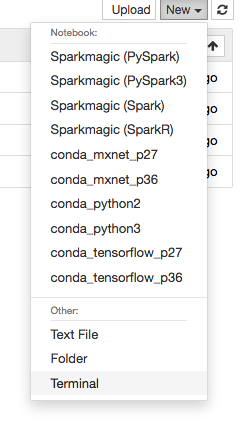
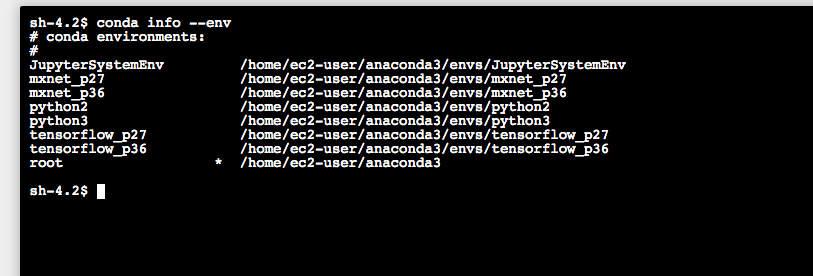
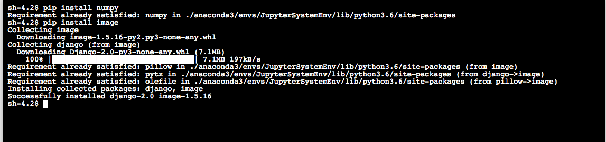

> I have seens some customer was trying to install some packages onto the SageMaker Notebook instance. This article describes how

### SageMaker notebook supports the ability to run command in a terminal console, (just like you ssh to a ec2 instance)

- When click on "New" -> Select"Terminal"

  


- This creates a new tab in the browser, now you will need to determine which env you are going to add the DIY package. To find out what env are there, use the following command:
  
  

- Then activate the env desired, as following:
  
  ```
  $ source activate python2
  ```
  
- The you can then install some packages in the terminal. E.g.



-

Note that, these env output from "conda info" gives different names from what you see in the SageMaker Notebook console. The followings are the corresponding mappings to them: (<Notebook> -> <conda info>)


conda_mxnet_p27            ->        mxnet_p27
conda_mxnet_p36            ->        mxnet_p36
conda_python2            ->        python2
conda_python3            ->        python3
conda_tensorflow_p27    ->        tensorflow_p27
conda_tensorflow_p36    ->        tensorflow_p36
